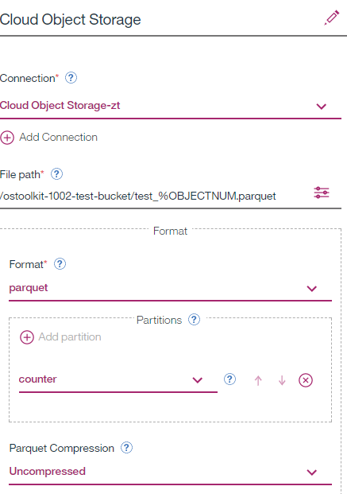

Integration Tests
=================

Object Storage Toolkit Version: 1.0.0.2

Test 1
------

1.  **Flow name:** 1KSmallPartitions

2.  **Test target:** check ObjectStorageSink operator behavior with big number
    (1K) of simultaneous partitions

3.  **Flow description:** 1000 tuples + 20 tuples/sec

4.  **Flow structure:**

5.  **Object Storage Sink Configuration**

6.  **Test Results:** all objects have been created as expected and with a
    required content. Pace of output objects creation is relatively slow
