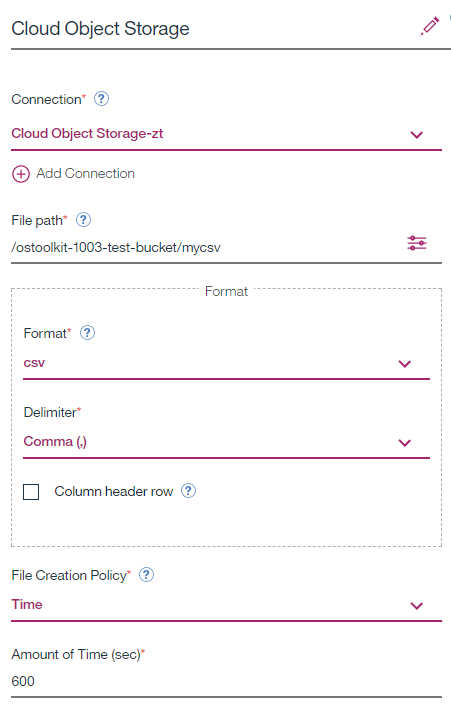
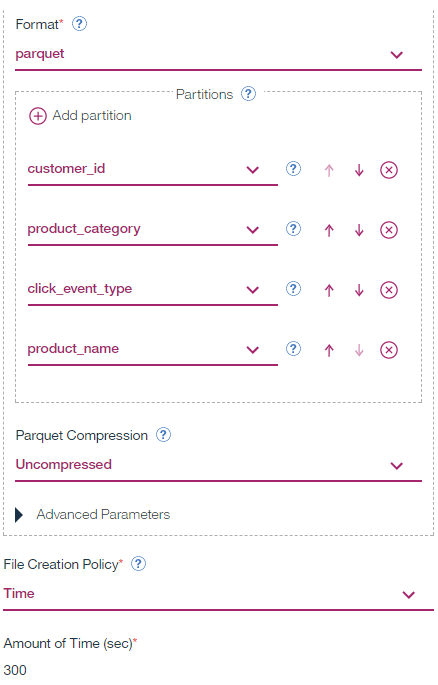
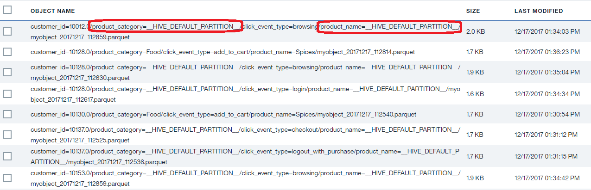
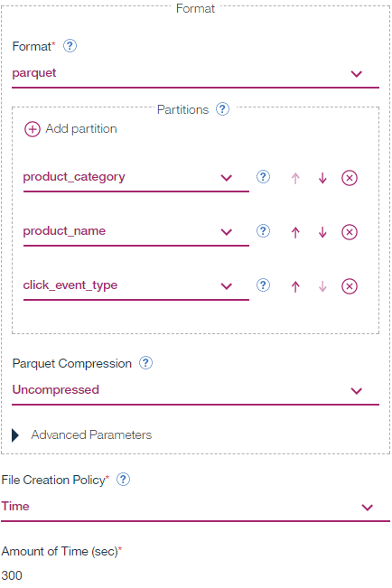
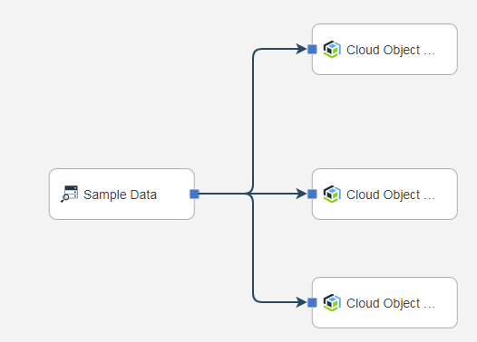
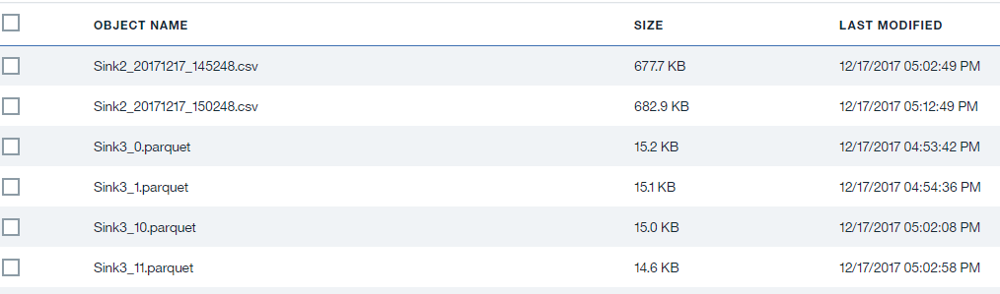

Integration Tests
=================

Object Storage Toolkit Version: 1.0.0.2

Test 1
------

1.  **Flow name:** 1KSmallPartitions

2.  **Test target:** check ObjectStorageSink operator behavior with big number
    (1K) of simultaneous partitions

3.  **Flow description:** 1000 tuples + 20 tuples/sec

4.  **Flow structure:**

1.  **Object Storage Sink Configuration**

1.  **Test Results:** all objects have been created as expected and with a
    required content. Pace of output objects creation is relatively slow

Tests 2-4
---------

1.  **Flow name:** CSVTestNoVars_[2-4]

2.  **Test target:**

    >   Object Storage Operator Configuration:

    >   Storage format = csv

    >   Test 2 -\> Rolling policy = time (10 mins)

    >   Test 3 -\> Rolling policy = size (100K)

    >   Test 4 -\> Rolling policy = count (3000)

    >   No variables in the output object name

    >   Expected output: Single object of CSV format refreshed every 5 minutes

3.  **Data Source:** Data Historian Sample Data

4.  **Flow structure:**

1.  **Object Storage Sink Configuration**

1.  **Test Results:** as expected. (Remark: all three flows are executed in
    parallel with the output to the different objects of the same bucket).

Tests 5-7
---------

1.  **Flow name:** MultipleParquetPartitions_[5-7]

2.  **Test target:**

    >   Object Storage Operator Configuration:

    >   Storage format = parquet

    >   Test 5 -\> Rolling policy = time (5 mins) + Uncompressed

    >   Test 6 -\> Rolling policy = size (100K) + Gzip

    >   Test 7 -\> Rolling policy = count (500)+ Snappy

    >   %TIME variable

    >   Four levels of partitioning

3.  **Data Source:** Click Stream Sample Data

4.  **Flow structure:**

1.  **Object Storage Sink Configuration**

1.  **Test Output**

The test checks:

-   Automatic partition insertion before object name

-   Null partitions creation

Tests 8-10
----------

1.  **Flow name:** MultipleParquetPartitions

2.  **Test target:**

    >   Object Storage Operator Configuration:

    >   Storage format = parquet

    >   Test 5 -\> Rolling policy = time (5 mins) + Uncompressed

    >   Test 6 -\> Rolling policy = size (100K) + Gzip

    >   Test 7 -\> Rolling policy = count (5000) + Snappy

    >   %OBJECTNUM variable

    >   Three levels of partitioning

    >   Object path consists of prefix1/prefix2/objectName_%OBJECTNUM.parquet

3.  **Data Source:** Click Stream Sample Data

4.  **Flow structure:**

1.  **Object Storage Sink Configuration**

Tests 11
--------

1.  **Flow name:** MultipleSinkInstances

2.  **Test target:**

-   The test contains three sink operators:

    -   Parquet + partitioning by *customerId* + snappy compression + close by
        object size

    -   CSV + time rolling policy (close every 10 mins)

    -   Parquet + no partition + gzip compression + close by event count (1000
        events)

1.  **Data Source:** Geofence Sample Data

2.  **Flow structure:**

1.  **Test Runtime**: 30 minutes

2.  **Test Output:**

>   After 10 minutes of running we have two objects per partition (total
>   partitions number is 34):

